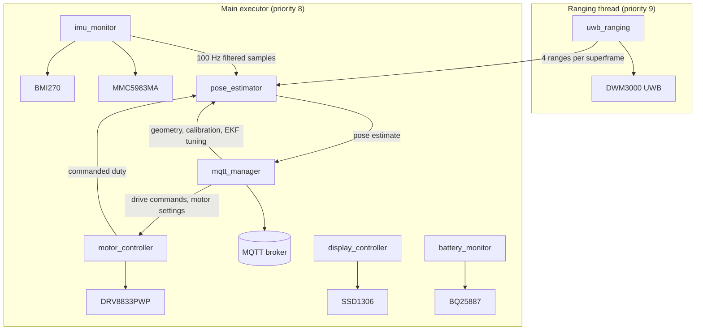

# Dropbot firmware

> Dropbot is an open source, low cost, robot designed to form a swarm of robots that can be used for practical research in swarm robotics.

This repository holds **two** firmware applications, both built on [ariel-os](https://github.com/ariel-os/ariel-os):

| App | Target | Directory | Build |
|---|---|---|---|
| `dropbot-firmware` | ESP32-C6 | repo root (`src/`) | `laze build -b dropbot -a dropbot-firmware` |
| `uwb-anchor-firmware` | STM32L432KC | [`anchor/`](anchor/) | `laze -C anchor build -b uwb-anchor -a uwb-anchor-firmware -s anchor-1` |

They share the UWB stack through five library crates, so a change to the radio protocol is a
change in one place rather than two divergent ones:

| Crate | Contents |
|---|---|
| [`crates/uwb-protocol`](crates/uwb-protocol) | Wire format, TDMA timing tables, slot arithmetic, the ranging maths. No dependencies at all, and host-testable: `cargo test --manifest-path crates/uwb-protocol/Cargo.toml`. |
| [`crates/dw3000-hal`](crates/dw3000-hal) | Everything about driving a DW3000 that is not about a particular board: bring-up, the async transmit/receive helpers, the `SYS_STATUS` flag-clearing workaround. Generic over `embedded-hal-async`'s `SpiDevice` and `Wait`. |
| [`crates/dropbot-estimation`](crates/dropbot-estimation) | The robot-side pose estimator. Host-testable. |
| [`crates/dropbot-calibration`](crates/dropbot-calibration) | Journaled antenna-delay record, CRC/device/PHY validation and rollback selection. Host-testable. |
| [`crates/uwb-fixture`](crates/uwb-fixture) | Shared six-direction, three-node DS-TWR fixture schedule used by separate ESP32 and STM32 fixture images. |

Each app supplies only its own pin and bus glue: [`src/drivers/uwb/`](src/drivers/uwb/) for the
robot, [`anchor/src/drivers/uwb.rs`](anchor/src/drivers/uwb.rs) for the anchor.

The anchor identity is a build-time choice -- `-s anchor-1` through `-s anchor-4` select which entry
of `uwb_protocol::ANCHOR_IDS` a binary is, with `anchor-1` (the TDMA timing master) as the default.
There is deliberately no runtime discovery: an anchor in the wrong slot collides with another
anchor, and a collision on air looks like poor RF rather than like a misconfiguration.

`laze` scopes `-a` to apps defined in the working directory, which is why the anchor needs `-C
anchor`. Both apps read contexts, the out-of-tree `stm32l432kc` chip context and the anchor identity
modules from the single root [`laze-project.yml`](laze-project.yml).

## Overview

The robot is composed of the following components:
- **Microcontroller**: ESP32-C6
- **Motors Driver**: DRV8833PWP driving two N20 micro gear motors
- **Power**: 2S1P LiPo battery (7.4V) with a BQ25887 battery management IC powered via USB-C
- **UWB**: DWM3000 (DW3000) for ranging and indoor localization
- **IMU**: MMC5983MA and BMI270 for orientation and acceleration sensing
- **Proximity Sensors**: VL53L1X or VL53L8X ToF sensors for obstacle detection

### Communication

The ESP32-C6 microcontroller provides Wi-Fi connectivity for remote control and data transmission. The DWM3000 UWB module ranges against four fixed anchors (see [`anchor/`](anchor/)) to fix the robot's position, fused with the onboard IMU for orientation, for indoor localization within the swarm's operating space.

The anchors have no network interface of any kind -- no UART header, no USB connector, no radio other than the DW3000 -- which is a deliberate constraint of the architecture rather than an oversight: the anchors stay dumb, stateless beacons and the robots do the position solving, which is also where the answer is needed for closed-loop control. RTT over SWD is the only way anything gets out of an anchor.

MQTT is used as the communication protocol for sending commands and receiving data from the robot.

### MQTT topics

All payloads are JSON. Most topics are namespaced with the robot's device ID (`{id}`), a
6-character uppercase hex string derived from the low 3 bytes of the ESP32-C6's factory MAC
address at boot (e.g. `/telemetry/A1B2C3`), so every robot in the fleet publishes and subscribes
on its own set of topics without colliding with the others -- including `/config/robots/{id}`, which
carries the settings that belong to one chassis rather than to the arena. The exceptions are
`/config/tag-assignments`, `/config/anchors` and `/config/estimation`, which are shared by the whole
fleet on purpose (see below).

#### Published by the robot

| Topic | Rate | Payload | Purpose |
|---|---|---|---|
| `/pose/{id}` | ~14 Hz (once per UWB superframe) | `x_m`, `y_m`, `heading_rad`, `speed_m_s`, `position_variance_m2`, `anchors_used`, timestamp | **The robot's own fused position estimate**, from the onboard trilateration + unicycle-EKF filter in [`crates/dropbot-estimation`](crates/dropbot-estimation). Computed onboard rather than on a server: that is where it is needed for closed-loop control, a Wi-Fi round trip is slower than the ranging period it would be correcting, and a broker outage should not cost the robot its position. Read `position_variance_m2` as "how much should this be trusted" and `anchors_used` as coverage -- two or fewer means the fix is leaning on the motion model. The filter can be switched off from `/config/estimation`, which leaves the same topic carrying the raw trilateration instead -- see that row for what changes. |
| `/telemetry/{id}` | 1 Hz | Motor state, battery status, latest IMU sample, network status, bundled together | General-purpose status snapshot for dashboards and monitoring. Each field is the most recently received value from its source, not all sampled at the same instant. |
| `/imu/{id}` | 10 Hz | Raw and filtered accelerometer/gyroscope/magnetometer, attitude quaternion, roll/pitch/heading, with a boot-relative timestamp | IMU stream for observers. Was 50 Hz while an off-board filter was going to consume it; now the fusion filter runs onboard and takes every sample at the full 100 Hz internally, without touching the network, so this is decimated to a fifth of the bandwidth. 50 Hz across twelve robots was ~2.7 Mbit/s of JSON on one 2.4 GHz access point. Raise `STREAM_INTERVAL` in [src/tasks/imu_monitor.rs](src/tasks/imu_monitor.rs) for an offline analysis session. |
| `/uwb/{id}` | **Off by default**; up to 4 messages per ~70 ms superframe when enabled | Anchor ID, distance in millimetres, sequence, response sub-slot, timestamp, applied clock-ratio correction and whether it had converged | One message per accepted range. Enable it with `publish_raw_ranges` on `/config/estimation` for one robot during calibration, then turn it off. `response_subslot` separates a reply-delay/clock residual from an orientation-dependent RF error. |
| `/calibration/status/{id}` | On calibration events | JSON tagged by `state` | Physical-arm window, capture lifecycle, stable rejection reasons and confirmed flash generation. |
| `/calibration/samples/{id}` | Fixture image only, during capture | Session, directed pair, sequence and DS-TWR distance | Samples consumed by the host `uwb-calibrate` tool; production images never emit fixture frames. |

#### Subscribed by the robot

| Topic | Payload | Purpose |
|---|---|---|
| `/motors/{id}` | `Move { left, right }` (normalized duty cycle, roughly -1..1 per side) or `Stop` | Remote drive commands. A 3-second command watchdog stops the motors automatically if no new command arrives, so a dropped connection cannot leave the robot driving unattended. |
| `/config/robots/{id}` | `{ "motors": { ... }, "localization": { "range_offset_mm": 0, "full_duty_speed_m_s": 0.5, "antenna_offset_x_m": 0.0, "antenna_offset_y_m": 0.0 } }` | Retained per-chassis settings. The antenna lever arm is rotated by heading in the UWB measurement model while the published pose remains at chassis centre. |
| `/calibration/command/{id}` | Tagged `start_capture`, `apply_robot_delay` or `clear_robot_delay` | Calibration control. Permanent writes additionally require stopped motors and a 1.5–3 s physical button hold that opens a 60 s window. |
| `/ota/check/{id}` | Ignored -- any message on this topic is treated as a trigger | Asks the robot to check the OTA update server immediately instead of waiting for its periodic check, for pushing a firmware update on demand. |
| `/config/tag-assignments` | List of `{ device_id, tag_index }` entries covering the whole fleet | Retained message overriding which of the 12 UWB TDMA time slots each robot transmits its ranging `Poll` in, so the fleet's slot assignments can be changed without reflashing any firmware. Falls back to a compiled default per robot when this topic is empty or unreachable, so ranging still works from a cold boot with no network. The whole list is checked for a duplicate `device_id` or `tag_index` before any entry in it is trusted -- two robots in the same slot would transmit over each other. |
| `/config/anchors` | `robot_antenna_height_m` plus `{ anchor_id, x, y, z, offset_mm, scale_ppm, range_sigma_m }` entries | Retained arena survey and per-anchor calibration. `range_sigma_m` is optional and lets a consistently noisier link carry less EKF weight, which matters with the robot antenna mounted horizontally. **Required for a pose**: the compiled geometry is deliberately empty, preventing a confident pose in the wrong frame. |
| `/config/estimation` | `{ "fusion_enabled": true, "publish_raw_ranges": false, "filter": { ... } }` | Retained fleet tuning for the EKF. It controls process noise, range sigma, zero-velocity uncertainties and asymmetric long/short gates; missing fields keep defaults and numeric input is finite-checked and clamped. `fusion_enabled: false` publishes raw per-superframe trilateration for comparison. See [localization calibration and tuning](docs/localization-calibration.md). |

The complete hardware fixture, anchor UID manifest, NVS provisioning and site-fit procedure is in
[DWM3000 calibration, site fit and EKF tuning](docs/localization-calibration.md). Production anchor
delay/UID values are compiled from [`anchor/calibration.toml`](anchor/calibration.toml); an empty or
mismatched UID disables ranging rather than silently assigning the physical board the wrong anchor ID.

### Software

The firmware is developed using embedded Rust on ariel-os, using `embedded-hal` traits for motor control, sensor interfacing, and communication. Where ariel-os has no abstraction for something the firmware needs, it goes straight to the underlying HAL and says why in a comment: `esp-hal` for the robot's SPI, MCPWM and eFuse, `embassy-stm32` for the anchor's DMA SPI, ADC and clock tree. The firmware is designed to be modular and extensible, allowing for easy addition of new features and sensors in the future.

Embassy is used for task scheduling and concurrency, enabling efficient management of the various components and sensors on the robot.

As follows is a high-level overview of the firmware architecture:

`pose_estimator` is where the two sensing paths meet: it predicts at the IMU's full rate and corrects
whenever ranges arrive, so the pose keeps moving between fixes instead of stepping once per
superframe. The filter itself is in [`crates/dropbot-estimation`](crates/dropbot-estimation), separate
from the task so it can be tested on the host against synthetic trajectories. Publishing
`{"fusion_enabled": false}` on `/config/estimation` takes it out of that path entirely and leaves
`/pose/{id}` carrying the bare trilateration of each superframe's ranges, which is the comparison
that says whether the filter is helping.

Ranging sits on its own higher-priority thread rather than on the main executor. It is the one job in
the firmware with a hard deadline it cannot recover from -- miss the moment to program a delayed
`Poll` and the whole superframe passes empty -- and the main executor is cooperative, so a long
stretch of Wi-Fi or display work would otherwise be enough to lose it.

The firmware is designed to be efficient (in terms of both performance and power consumption) while providing the necessary functionality for controlling the robot and enabling swarm behavior. Real-time constraints are considered, especially for motor control and sensor reading, to ensure responsive behavior in dynamic environments, i.e., when navigating around obstacles or coordinating with other robots in the swarm.
