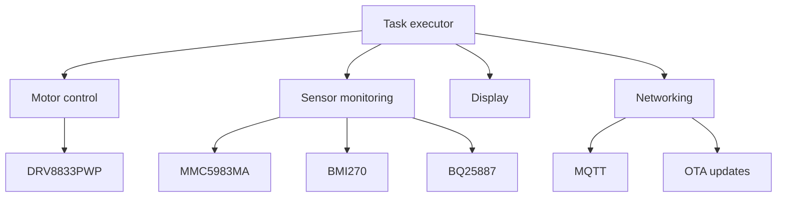

# Dropbot firmware

> Dropbot is an open source, low-cost robot designed to form a swarm for practical research in
> swarm robotics.

This repository contains the ESP32-C6 firmware for the robot, built on
[ariel-os](https://github.com/ariel-os/ariel-os).

## Build

```sh
laze build -b dropbot -a dropbot-firmware
```

The build also generates the app-only image accepted by the OTA updater at
`build/bin/dropbot/dropbot-firmware/dropbot-firmware.bin`. This is intentionally not a merged
full-flash image: flash the ELF for initial provisioning and upload the `.bin` to the OTA server
for subsequent updates.

The development shell in `flake.nix` provides the Rust toolchain, `laze`, `espflash` and the other
build tools used by CI.

## Hardware overview

- **Microcontroller**: ESP32-C6
- **Motor driver**: DRV8833PWP driving two N20 micro gear motors
- **Power**: 2S1P LiPo battery with a BQ25887 battery management IC powered via USB-C
- **IMU**: MMC5983MA magnetometer and BMI270 accelerometer/gyroscope
- **Display**: SSD1306-compatible OLED
- **Connectivity**: Wi-Fi

## Communication

MQTT carries remote commands and robot telemetry. All payloads are JSON, and each topic is
namespaced with the robot's device ID (`{id}`), a six-character uppercase hexadecimal string
derived from the low three bytes of the ESP32-C6 factory MAC address at boot.

### Published by the robot

| Topic | Rate | Purpose |
|---|---|---|
| `/telemetry/{id}` | 1 Hz | Aggregated motor, battery, IMU and network status. |
| `/imu/{id}` | 10 Hz | Raw and filtered accelerometer, gyroscope and magnetometer data, attitude and a boot-relative timestamp. |

### Subscribed by the robot

| Topic | Payload | Purpose |
|---|---|---|
| `/motors/{id}` | `Move { left, right }` or `Stop` | Remote drive commands. A three-second watchdog stops the motors when commands cease. |
| `/ota/check/{id}` | Ignored | Triggers an immediate check of the OTA update server. |
| `/config/ota` | `{"server":"192.168.8.1"}` | Sets the fleet-wide OTA HTTP server. A `host:port` value is accepted. Publish this configuration retained so robots receive it after connecting. |

There is no compile-time OTA server default. The OTA task waits for a valid `/config/ota`
message before starting its periodic checks; changing the retained value takes effect on the next
check without rebooting the robot.

## Architecture

The firmware is written in embedded Rust. Embassy tasks independently manage motor control, the
display, battery monitoring, the IMU, networking, MQTT and OTA updates. Devices on the shared I2C
bus use async `embedded-hal` traits so no single peripheral owns the bus.


