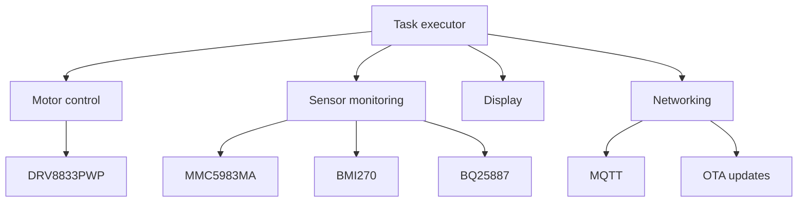

# Dropbot firmware

> Dropbot is an open source, low-cost robot designed to form a swarm for practical research in
> swarm robotics.

This repository contains the ESP32-C6 firmware for the robot, built on
[ariel-os](https://github.com/ariel-os/ariel-os).

## Build

```sh
laze build -b dropbot -a dropbot-firmware
```

The build also generates the app-only image accepted by the OTA updater at
`build/bin/dropbot/dropbot-firmware/dropbot-firmware.bin`. This is intentionally not a merged
full-flash image: flash the ELF for initial provisioning and upload the `.bin` to the OTA server
for subsequent updates.

The development shell in `flake.nix` provides the Rust toolchain, `laze`, `espflash` and the other
build tools used by CI.

## Hardware overview

- **Microcontroller**: ESP32-C6
- **Motor driver**: DRV8833PWP driving two N20 micro gear motors
- **Power**: 2S1P LiPo battery with a BQ25887 battery management IC powered via USB-C
- **IMU**: MMC5983MA magnetometer and BMI270 accelerometer/gyroscope
- **Display**: SSD1306-compatible OLED
- **Connectivity**: Wi-Fi

## Communication

MQTT carries remote commands and robot telemetry. All payloads are JSON. Topics are namespaced
with the robot's device ID (`{id}`), a six-character uppercase hexadecimal string derived from
the low three bytes of the ESP32-C6 factory MAC address at boot.

### MQTT Topics

| Topic | Direction | Purpose | QoS | Retained | Notes |
|---|---|---|---|---|---|
| `/telemetry/{id}` | Publish | Aggregated motor, battery, IMU and network status (JSON). | 0 | No | 1 Hz rate. JSON includes motor speed, battery voltage, IMU samples, Wi-Fi signal strength. |
| `/imu/{id}` | Publish | Raw and filtered accelerometer, gyroscope, magnetometer data with attitude and boot-relative timestamp (JSON). | 0 | No | 10 Hz rate. High-rate stream kept separate from telemetry so subscribers can choose data rate. |
| `/motors/{id}` | Subscribe | Drive commands: `{"left": <int16>, "right": <int16>}` (move) or `{}` (stop). | 0 | No | Three-second watchdog stops motors when commands cease. Accepts any `left`/`right` value from -127 to 127. |
| `/ota/check/{id}` | Subscribe | Trigger immediate OTA update check. Payload is ignored. | 0 | No | Robot checks OTA server on receipt. Completes within minutes depending on network. |
| `/config/ota` | Subscribe | Fleet-wide OTA server configuration: `{"server":"192.168.8.1"}` or `{"server":"192.168.8.1:8080"}`. | 0 | **Yes** | Publish retained so robots receive it after connecting. No compile-time default. Robot waits for this message before starting periodic OTA checks. Takes effect on next check; no reboot required. |

All published messages use QoS 0 (at-most-once, no acknowledgment). The `/config/ota` topic must be published with the retain flag set so new robots joining the swarm fetch the configuration on subscription.

## Architecture

The firmware is written in embedded Rust. Embassy tasks independently manage motor control, the
display, battery monitoring, the IMU, networking, MQTT and OTA updates. Devices on the shared I2C
bus use async `embedded-hal` traits so no single peripheral owns the bus.


